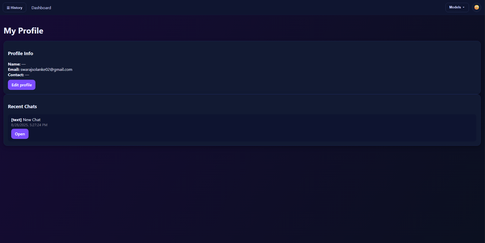

# Gen AI - Multimodal Chatbot

> Local-first agentic multimodal assistant with Text, Image, Audio, and Video tools. Powered by FastAPI, Ollama (Mistral/LLaVA), Diffusers or Automatic1111, faster-whisper ASR, and Edge-TTS. Includes JWT auth, history, and user profiles.

---

## ✨ Features
- **Authentication**: Email/password signup & login with secure JWT cookies
- **Text Chat**: Mistral (via Ollama) with lightweight RAG using Qdrant embeddings
- **Image Tools**:
  - Image captioning and VQA using vision model (LLaVA/Qwen-VL via Ollama)
  - Text-to-Image via Automatic1111 or local Diffusers fallback
- **Audio Tools**:
  - ASR with faster-whisper
  - TTS with Edge-TTS (Microsoft Neural voices)
- **Video Tools**:
  - Analyze videos by sampling frames + vision model
  - Text-to-Video using ModelScope (if GPU available)
- **History & Profiles**: Persisted chats by modality, user profile view/edit
- **Frontend**: Jinja2 templates + vanilla JS; modern dark UI with history drawer

---

## 🏗️ Architecture

```mermaid
graph TD
  subgraph Browser [Frontend]
    UI[Templates + JS]\n(base.html, dashboard, chat, image, audio, video, profile)
    Static[Static Assets]\n(CSS/JS)
  end

  subgraph API [FastAPI Backend]
    RouterAuth[/routers/users.py/]
    RouterChat[/routers/chat.py/]
    RouterImage[/routers/image.py/]
    RouterAudio[/routers/audio.py/]
    RouterVideo[/routers/video.py/]
    RouterHistory[/routers/history.py/]
    RouterProfile[/routers/profile.py/]
    Services[services/*]
    Models[(SQLAlchemy Models)]
  end

  subgraph Data [Storage/Models]
    DB[(SQL DB)]
    Qdrant[(Qdrant Vector DB)]
    Media[(media/*)]
  end

  UI -->|XHR/fetch| API
  Static -.-> UI
  RouterAuth --> DB
  RouterChat --> Services
  RouterImage --> Services
  RouterAudio --> Services
  RouterVideo --> Services
  RouterHistory --> DB
  RouterProfile --> DB
  Services --> DB
  Services --> Qdrant
  Services --> Media
```

---

## 🔐 Auth Flow


Key files:
- `backend/app.py`: mounts static/templates, CORS, JWT redirect middleware, page routes, includes API routers
- `backend/routers/users.py`: signup/login/logout (sets cookie `token`)
- `backend/deps.py`: `get_db` and `get_current_user_id` from cookie
- `backend/auth.py`: password hashing and JWT helpers

---

## 💬 Text Chat Flow

```mermaid
sequenceDiagram
  participant UI as chat_text.html + JS
  participant C as /api/chat (chat.py)
  participant VS as vectorstore (Qdrant)
  participant L as Ollama (Mistral)
  participant DB as SQL (chats/messages)

  UI->>C: POST /api/chat/new (optional)
  C->>DB: Create Chat row
  UI->>C: POST /api/chat/send {chat_id, message}
  C->>DB: Save user Message
  C->>VS: embed_texts + upsert; search for context
  C->>L: generate(prompt+context)
  L-->>C: reply
  C->>DB: Save assistant Message
  C-->>UI: {chat_id, reply}
```

Key pieces:
- `backend/routers/chat.py`: endpoints `/new`, `/send`, `/list`, `/{id}`
- `backend/services/embeddings.py`: SentenceTransformer encoder
- `backend/services/vectorstore.py`: Qdrant collection ensure/upsert/search
- `backend/services/ollama_client.py`: calls Ollama `/api/generate`

---

## 🖼️ Image Tools Flow


---

## 🔊 Audio Tools Flow


---

## 🎬 Video Tools Flow

```mermaid
sequenceDiagram
  participant UI as video_tools.html + video.js
  participant V as /api/video (video.py)
  participant VS as vision model (Ollama LLaVA)
  participant ASR as faster-whisper
  participant DB as SQL

  UI->>V: POST /query (UploadFile)
  V->>V: sample_frames + caption per frame (base64 → Ollama)
  V-->>UI: {chat_id, analysis}

  UI->>V: POST /generate (prompt)
  V->>V: text_to_video (ModelScope) → media/video/*.mp4
  V-->>UI: {chat_id, video_url}

  UI->>V: POST /caption (UploadFile)
  V->>V: frames summary + extract audio → ASR
  V-->>UI: {chat_id, summary, transcript}
```



---

## 📁 Project Structure

```
backend/
  app.py                 # FastAPI app, middleware, pages, routers
  auth.py                # JWT + password hashing
  config.py              # Settings from .env
  database.py            # SQLAlchemy engine/session
  deps.py                # get_db, get_current_user_id
  models.py              # User, Chat, Message
  routers/
    users.py             # /api/auth: login/signup/logout
    chat.py              # /api/chat: new/send/list/get
    image.py             # /api/image: query/generate
    audio.py             # /api/audio: query/generate/caption
    video.py             # /api/video: query/generate/caption
    history.py           # /api/history: list, get
    profile.py           # /api/profile: me, update, recent-chats
  services/
    ollama_client.py     # text/vision generation
    embeddings.py        # sentence-transformers
    vectorstore.py       # Qdrant collection + ops
    vision_tools.py      # image save, caption, VQA
    image_gen.py         # A1111 or Diffusers txt2img
    asr.py               # faster-whisper basic ASR
    audio_caption.py     # ASR + caption via LLM
    tts.py               # Edge-TTS MP3 generator
    video_tools.py       # sampling, caption, text2video
frontend/
  templates/             # Jinja2 pages (base, dashboard, chat, tools, auth, profile)
  static/
    css/style.css        # modern dark theme
    js/*.js              # common UI, chat, image, audio, video
requirements.txt
README.md
```

---

## 🖼️ Screenshots (images in `img/`)

Place your images in the `img/` folder with these filenames:

- Edit Profile page → `img/e.png`
- Updated Profile page → `img/upd.png`
- My Profile page → `img/my.png`
- Image Generation → `img/img-gen.png`
- Image Captioning → `img/img-capt.png`
- Video Generation → `img/video-gen.png`
- Text Model (Chat) → `img/txt.png`
- Text-to-Speech (TTS) → `img/tts.png`
- Speech-to-Text (STT) → `img/stt.png`
- History → `img/history.png`

```markdown





```

Note: If your filenames contain spaces (e.g., `img/Vdo Gen & Cpt.png`), Markdown supports them, but you may prefer to rename to simple, hyphenated names for portability.

---

## ⚙️ Setup & Run

1) Install Python deps
```bash
pip install -r requirements.txt
```

2) Start external services
- Qdrant (vector DB):
```bash
docker run -p 6333:6333 -v qdrant_storage:/qdrant/storage qdrant/qdrant
```
- Ollama (text + vision models):
```bash
ollama serve
ollama pull mistral
ollama pull llava:latest   # or qwen2.5-vl
```
- Optional: Automatic1111 Web UI on `http://127.0.0.1:7860` for txt2img
- Optional: ffmpeg in PATH for better video/audio operations

3) Create `.env` (see keys below)
```bash
copy .env.example .env   # Windows
# or
cp .env.example .env     # macOS/Linux
```

4) Run backend
```bash
uvicorn backend.app:app --reload
```
Open `http://127.0.0.1:8000` → Sign up → Explore tools.

---

## 🔧 Configuration (.env)
Minimum required:
- `DATABASE_URL` (e.g., `sqlite:///./app.db` or MySQL/Postgres)
- `JWT_SECRET`

Optional/Defaults:
- `OLLAMA_HOST` (default `http://localhost:11434`)
- `OLLAMA_TEXT_MODEL` (default `mistral:latest`)
- `OLLAMA_VISION_MODEL` (default `llava:latest`)
- `QDRANT_URL` (default `http://localhost:6333`)
- `QDRANT_COLLECTION` (default `chat_history`)
- `SENTENCE_EMBEDDINGS_MODEL` (default `sentence-transformers/all-MiniLM-L6-v2`)
- `A1111_URL` (if using Automatic1111)
- `FFMPEG_EXE` (optional explicit path)
- Edge-TTS voices: `EDGE_TTS_VOICE`, `EDGE_TTS_RATE`, `EDGE_TTS_VOLUME`

---

## 📚 API Overview
- Auth
  - POST `/api/auth/signup` {email,password} → sets cookie
  - POST `/api/auth/login` {email,password} → sets cookie
  - POST `/api/auth/logout` → clears cookie
- Chat
  - POST `/api/chat/new` {title?} → {id}
  - POST `/api/chat/send` {chat_id?, message}
  - GET `/api/chat/list`
  - GET `/api/chat/{id}`
- History
  - GET `/api/history/`
  - GET `/api/history/{id}`
- Image
  - POST `/api/image/query` (UploadFile `file`)
  - POST `/api/image/generate` (Form `prompt`)
- Audio
  - POST `/api/audio/query` (UploadFile `file`)
  - POST `/api/audio/generate` (Form `text`)
  - POST `/api/audio/caption` (UploadFile `file`)
- Video
  - POST `/api/video/query` (UploadFile `file`)
  - POST `/api/video/generate` (Form `prompt`)
  - POST `/api/video/caption` (UploadFile `file`)
- Profile
  - GET `/api/profile/me`
  - POST `/api/profile/update` (JSON or Form)
  - GET `/api/profile/recent-chats`

All protected endpoints require the `token` JWT cookie (set by signup/login).

---

## 🧠 Data Model


---

## 🚀 Quick Demo Flow
1. Sign up or log in
2. Open Text → ask a question; replies saved to history
3. Open Image → upload an image to caption or generate from text
4. Open Audio → transcribe a clip or synthesize speech
5. Open Video → analyze a short mp4 or generate a clip (GPU)
6. Open Profile → view recent chats and edit name/phone

---

## ✅ Notes & Tips
- Qdrant collection size auto-matches your embedding dimension (auto recreate if mismatched)
- Vision requests to Ollama must pass base64 image data (handled in services)
- Media files are saved under `media/images` and `media/audio` and `media/video`
- For Text-to-Video, a CUDA GPU is required; otherwise skip this feature
- Edge-TTS generates MP3 by default; the API returns a web path to play in the browser

---

## 🧩 Tech Stack
- Backend: FastAPI, SQLAlchemy, Pydantic
- AI: Ollama (Mistral, LLaVA), Sentence-Transformers, faster-whisper, Diffusers/Automatic1111, Edge-TTS
- Storage: SQL DB (SQLite/MySQL/Postgres), Qdrant
- Frontend: Jinja2, Vanilla JS, CSS

---

## 📄 License
MIT (adjust as needed)
